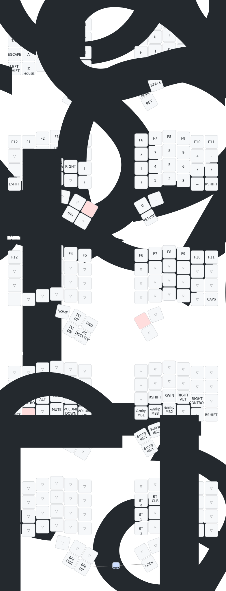

# Introduction

This is for the zmk layout for the brain and sweep/urchin keyboards.
It contains swedish characters and swedish symbol codes

Zmk config for charybdis (4x6)
Editor: https://nickcoutsos.github.io/keymap-editor/

## Layout

